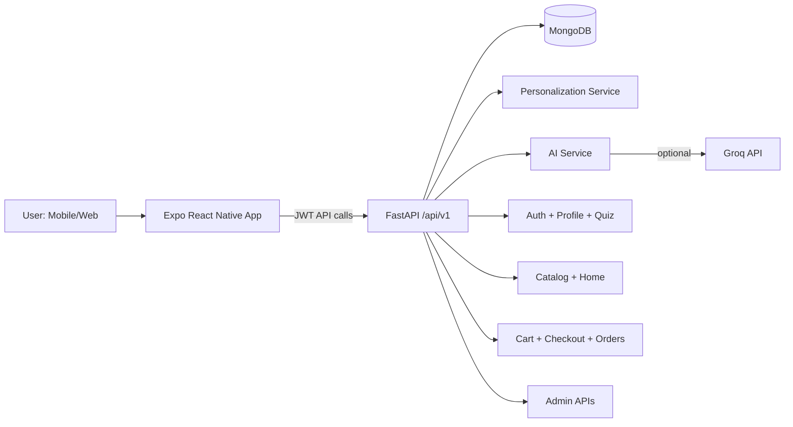

# Olive & Oak - System Architecture and Implementation Progress

Last updated: 2026-04-10

## 1) Project Overview

Olive & Oak is a full-stack personalized ecommerce platform for interior and home products.

Current implementation stack:
- Backend: FastAPI + MongoDB (Motor)
- Client: Expo React Native (TypeScript), running on both mobile and web
- Personalization: quiz-driven scoring + profile-aware ranking
- AI: chat and visual recommendation endpoints with optional Groq integration
- Commerce: catalog, cart, demo checkout, orders, and admin product management

Core user journey:
- Landing -> Auth -> Quiz -> Personalized Home -> Category/Catalog -> Cart -> Checkout -> Orders

## 2) Repository Architecture

Top-level folders:
- `backend/`: FastAPI services, Mongo integration, API routes, schemas, seeding, personalization logic
- `mobile/`: React Native + React Native Web app, navigation/screens/components/store/theme
- `olive_oak_system_spec.dm`: product and architecture master spec (original planning document)

Important top-level docs:
- `README.md`: setup and run guide
- `PROJECT_ARCHITECTURE_AND_PROGRESS.md`: this architecture + progress document

## 3) High-Level Runtime Architecture

## 4) Backend Architecture (FastAPI)

### 4.1 Application bootstrap

Main app entry:
- `backend/app/main.py`

Startup lifecycle:
- Connect DB
- Ensure DB indexes
- Ensure seed data

Middleware:
- CORS (configured from settings)
- TrustedHost middleware in staging/production
- GZip compression
- Request context headers (`x-request-id`, `x-process-time-ms`)
- Security headers (enabled by config)

Health endpoints:
- `/`
- `/health/live`
- `/health/ready`

Run script:
- `backend/run.py` starts `uvicorn` on port `8000`

### 4.2 Configuration

Config source:
- `backend/app/core/config.py`

Key settings:
- API prefix: `/api/v1`
- Mongo URI + DB name
- CORS allowlist + regex for local/dev networks
- Security/trusted host flags
- Admin bootstrap credentials
- Optional Groq settings (`groq_api_key`, models)

### 4.3 Data layer

DB module:
- `backend/app/core/database.py`

Mongo collections used (current implementation):
- users
- user_preferences
- categories
- products
- carts
- orders
- payments
- chat_messages
- visual_analysis
- quiz_configs

Indexes ensured:
- users.email (unique)
- products.sku (unique)
- categories.id (unique)
- user_preferences.user_id (unique)
- orders on user_id + created_at
- payments.payment_id (unique)
- chat_messages on user_id + _id

### 4.4 API modules and responsibilities

Routers included in `main.py`:
- auth
- quiz
- profile
- catalog
- cart
- orders
- ai
- admin

Endpoint map (all under `/api/v1`):

Auth (`/auth`)
- `POST /register`
- `POST /login`
- `GET /me`
- `PUT /profile`

Quiz (`/quiz`)
- `GET /questions`
- `POST /submit`

Profile (`/me`)
- `GET /me`
- `GET /preferences`
- `PUT /preferences`

Catalog/Home
- `GET /products`
- `GET /categories`
- `GET /categories/{category_id}/products`
- `GET /products/{sku}`
- `GET /home/personalized`

Cart/Checkout (`/cart`)
- `GET /cart`
- `POST /cart/items`
- `PATCH /cart/items/{product_id}`
- `DELETE /cart/items/{product_id}`
- `POST /cart/checkout`
- `POST /cart/demo-payment/create`
- `POST /cart/demo-payment/confirm`

Orders (`/orders`)
- `GET /orders/my`

AI (`/ai`)
- `POST /ai/chat`
- `POST /ai/query` (compat alias)
- `POST /ai/analyze-image`
- `POST /ai/visual-recommendations`

Admin (`/admin`)
- `POST /admin/products`
- `GET /admin/products`
- `PUT /admin/products/{sku}`
- `PATCH /admin/products/{sku}/status`
- `POST /admin/catalog/import-csv`
- `GET /admin/orders`
- `GET /admin/products/metrics`
- `GET /admin/db-snapshot`

### 4.5 Personalization and AI implementation details

Personalization service:
- `backend/app/services/personalization.py`

Current rank model:
- Style match weight
- Mood match weight
- Budget tier fit weight
- Base score

AI route behavior:
- Uses profile + product context + shopping logic templates
- Uses fallback deterministic response when no Groq key or provider failure
- Persists chat messages to `chat_messages`
- Visual recommendation route performs image analysis + category/mood/style extraction + reranking

### 4.6 Catalog robustness and schema normalization

`backend/app/api/catalog.py` now includes compatibility logic for mixed Mongo schemas.

What it normalizes:
- `Category` -> `category_id`
- `product_name` -> `name`
- `price` -> `price_inr`
- `link` / `image_url` variants -> `media.image_url`
- defaults for missing `is_active` behavior
- conversion of list-like fields for colors/materials

Category matching improvements:
- Handles `category_id` and `Category`
- Case-insensitive matching
- Variants for hyphen, underscore, space, and compact forms

This is especially important for importing and serving `classroom` records from legacy Mongo documents.

## 5) Frontend Architecture (Expo React Native + Web)

### 5.1 App shell

Entry:
- `mobile/src/App.tsx`

Navigation:
- Native stack navigation
- Initial route derived from auth state and role
- Admin users route to admin screens, customer users to home flow

Defined routes (`RootStackParamList`):
- Landing
- Auth
- Admin
- AdminProducts
- QuizAesthetic
- QuizMood
- QuizBudget
- Home
- Profile
- AllProducts
- Catalog
- ProductDetail
- Cart
- PaymentSuccess
- Orders

### 5.2 State and API communication

State:
- Auth state stored in Zustand (`mobile/src/store/authStore.ts`)

API client:
- `mobile/src/services/api.ts`
- Base URL from env/host inference
- JWT attached via interceptor
- Shared endpoint constants used across screens

### 5.3 UI composition and platform split

Home and catalog experience:
- `mobile/src/screens/HomeScreen.tsx`
- `mobile/src/screens/CatalogScreen.tsx`
- `mobile/src/screens/AllProductsScreen.tsx`

Platform-specific components:
- `GlbPreview.web.tsx` and `GlbPreview.native.tsx`
- Both currently use image thumbnails for category cards (no 3D model rendering in category cards)

Background system:
- Web quiz background uses shader-based `FluidBackground.web.tsx` (Three.js)
- Native quiz background uses animated gradient/blob `FluidBackground.native.tsx`

Landing:
- Native landing stabilization done in `LandingExperience.native.tsx` (single-line brand fit controls)

### 5.4 Auth and onboarding UX

Auth:
- `mobile/src/screens/AuthScreen.tsx` (native)
- Supports login via identifier, remember-me, register validation, and role-based routing
- Includes quiz completion check to route customer to either quiz or home

Quiz flow:
- Aesthetic -> Mood -> Budget
- Preferences persisted and used for ranking

## 6) Data and Domain Model (Current Practical Shape)

Although the original spec discusses relational tables, the live implementation uses Mongo documents.

Practical product shape expected by UI:
- sku
- name
- description
- category_id
- price_inr
- stock
- is_active
- media.image_url
- media.glb_url
- attributes.aesthetic_style
- attributes.mood_feel
- attributes.price_tier
- attributes.dominant_colors
- attributes.materials

Compatibility layer now allows ingestion from legacy fields such as:
- `Category`
- `product_name`
- `price`
- `link`
- `Aesthetic Style`, `Mood & Feel`, `Price Tier`, etc.

## 7) Major Work Completed So Far

This section summarizes major implementation progress completed in this workspace.

### 7.1 Core platform and commerce
- Full auth/register/login flow with JWT
- Quiz capture + preference persistence
- Personalized home feed and ranking
- Category browsing and product detail
- Cart management and demo payment to order creation
- Order history APIs and screens
- Admin product and order operations

### 7.2 Stability and compatibility
- Added broader CORS compatibility for local/web/mobile dev setups
- Added health endpoints and readiness checks
- Added request tracing headers and security middleware
- Added index creation and seed guarantees during startup

### 7.3 Profile/quiz parity and localization
- Unified quiz/profile option parity
- Budget ranges and mapping updated to INR-oriented values and tiers
- Preference update routes aligned with quiz model

### 7.4 Mobile/web platform-specific UX improvements
- Native landing title rendering stabilized (prevent truncation issues)
- Native quiz background switched to reliable light animated implementation
- Web quiz shader retained
- Mobile login experience upgraded with richer flow and back-to-landing behavior

### 7.5 Category and classroom expansion
- Added `classroom` category to fallbacks, priority order, and thumbnails
- Added classroom card fallback in Home UI when backend category list is inconsistent
- Improved category data normalization and filtering to include classroom products from legacy Mongo docs
- Updated category image source handling with URL normalization (GitHub blob to raw)

### 7.6 Recent UI iteration notes
- A web Home aesthetic redesign was prototyped and then reverted based on feedback
- Current UI state is restored to the prior baseline while preserving category/data fixes

## 8) Current Known Constraints / Risks

- Demo payment flow is used (not integrated with a real payment gateway yet)
- AI quality depends on Groq key availability; fallback mode is deterministic and simpler
- Product data quality can vary if admin CSV or legacy imports are inconsistent
- Some external image hosts may block hotlinking; GitHub blob URLs require raw URL normalization

## 9) Recommended Next Steps

Priority engineering tasks:
1. Add real payment provider integration (Razorpay or equivalent) with webhook verification.
2. Add stricter product validation pipeline for legacy/imported docs before serving to UI.
3. Add automated tests for compatibility transforms in `catalog.py`.
4. Add observability metrics for endpoint latency and AI fallback frequency.
5. Add richer admin import report UI (per-row validation and correction hints).

Priority product tasks:
1. Finalize web visual design system (tokens + typography scale + spacing rhythm).
2. Harden image/CDN strategy to avoid third-party host breakages.
3. Expand personalization with behavior-based signals (clicks, adds, purchases) in ranking.

## 10) Quick Runbook

Backend:
- `cd backend`
- `pip install -r requirements.txt`
- Configure `.env`
- `python run.py`

Mobile/Web:
- `cd mobile`
- `npm install`
- Configure `.env` (`EXPO_PUBLIC_API_URL`)
- `npm run web` or `npm run start`

## 11) Reference Files

Backend core:
- `backend/app/main.py`
- `backend/app/core/config.py`
- `backend/app/core/database.py`

Backend APIs:
- `backend/app/api/auth.py`
- `backend/app/api/quiz.py`
- `backend/app/api/profile.py`
- `backend/app/api/catalog.py`
- `backend/app/api/cart.py`
- `backend/app/api/orders.py`
- `backend/app/api/ai.py`
- `backend/app/api/admin.py`

Mobile app:
- `mobile/src/App.tsx`
- `mobile/src/navigation/types.ts`
- `mobile/src/services/api.ts`
- `mobile/src/screens/HomeScreen.tsx`
- `mobile/src/screens/AuthScreen.tsx`
- `mobile/src/components/GlbPreview.web.tsx`
- `mobile/src/components/GlbPreview.native.tsx`
- `mobile/src/components/quiz/FluidBackground.web.tsx`
- `mobile/src/components/quiz/FluidBackground.native.tsx`

Planning spec:
- `olive_oak_system_spec.dm`
